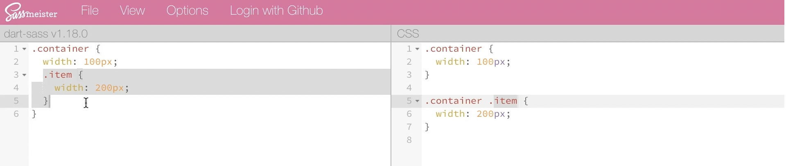
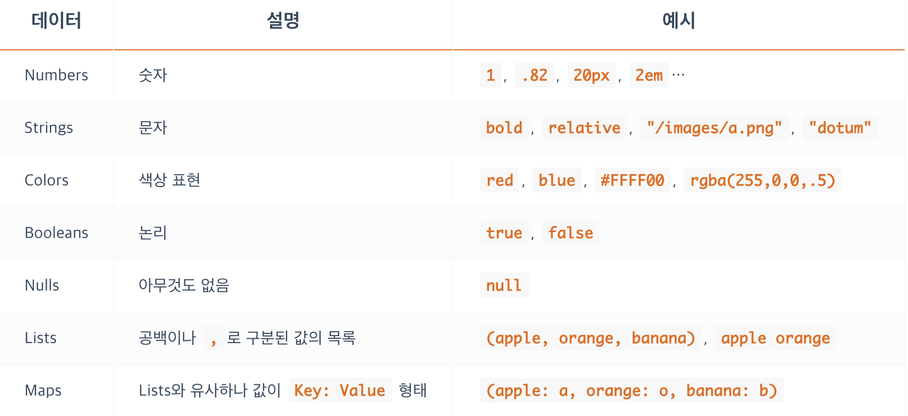

# Sass

## 1. Sass(SCSS) 개요

웹에서는 표준 css만 동작하기 때문에 Sass 등으로 작성된 것은 컴파일해서 css로 변환 후 사용해야 한다. 즉, CSS가 동작하기 전에 사용하는 기능이다.

그리고 이러한 종류의 전처리기들에는

- Less
- SASS(SCSS)
- Stylus

등이 있다.

이 중에서도 Sass가 가장 오래되었기 때문에, 참고할만한 자료들이 많다.

### 1.1 SCSS란?

SCSS는 CSS 구문과 완전히 호환되도록 새로운 구문을 도입해 만들어진 것이다. 이러한 SCSS는 Sass의 모든 기능을 지원하며, SCSS는 CSS와 거의 같은 문법으로 Sass 기능을 지원한다.

#### Sass

```sass
.happy-box-item
  width: 100px
  float: left
  li
    color: red
    background: url("./image.jpg")
    &:last-child
      margin-right: -10px

```

#### SCSS

```scss
.list {
  width: 100px;
  float: left;
  li {
    color: red;
    background: url("./image.jpg");
    &:last-child {
      margin-right: -10px;
    }
  }
}
```

SCSS와 Sass가 같은 것인줄 알고있었지만, 이 둘이 서로 다르다는 것과 서로 어떻게 연관되어 있는지 이번 기회에 알게 되었다. 또한 SCSS가 CSS와 완벽하게 호환된다는 사실을 처음 알수 있었다.

### 1.2 Sass 컴파일

Sass(SCSS)는 기본적으로 웹에서 직접 동작할 수 없기 때문에 최종적으로는 표준 CSS로 동작해야 하며, 전처리기로 작성 후 CSS로 컴파일해야 합니다. 작성된 Sass를 컴파일 하는 방법은 여러가지가 있는데, 아래는 그 예시이다.

- SassMeister

  여러 방법 중, SassMeister를 이용하는 방법은 간단한 작업을 할 때 빠르게 사용할 수 있는 방법으로, 아래와 같이 사용할 수 있다.

  
  <br/>

- node-sass
- Gulp
- Webpack
- Parcel

## 2. 기본 문법

### 2.1 주석

CSS 주석은 `/* ... */` 과 같은 방법으로 표시한다. 하지만 Sass는 아래와 같은 방식으로 주석을 단다.

```sass
/* ~~~
 * ~~~
 * ~~~ */
```

하지만 이때 중요한 점은, `*`의 라인을 맞춰줘야 한다는 것이다. 예시로, 아래와 같은 주석은 제대로 동작하지 않는다.

```sass
/* 컴파일되는
* 여러 줄
    * 주석 */
```

반면, SCSS는 각 줄에 `*`이 존재하지 않아도 동작한다는 차이가 있다.

```scss
/*
    ~~~
    ~~~
    ~~~
*/
```

### 2.2 데이터 타입

Sass 의 데이터 타입은 아래 그림과 같다.


<br/>

하지만, 여기서 반드시 지켜줘야 할 중요한 특징이 존재한다. 먼저, Numbers는 숫자에 단위가 있을 수도 있고, 없을 수도 있다. 그리고 Strings의 경우에는 문자에 따옴표가 없을 수도 있는데 이는 타 언어들과 차이가 있기 때문에 헷갈리지 않도록 조심해야 한다. 또한 속성값으로 null이 사용되면 컴파일하지 않게 되며 Lists는 괄호를 붙일 수도 있고, 붙이지 않아도 되지만 Map의 경우에는 반드시 괄호를 붙여줘야 동작한다는 점이 특징이다.

### 2.3 중첩

아마 일반적인 CSS와 가장 큰 차이가 있는 것이 중첩이 아닐까 생각한다. Sass(SCSS)는 중첩이라는 스킬을 통해 간편하게 CSS를 표현할 수 있다. 예를 들어서, 아래와 같은 CSS 코드가 있다고 가정해보자.

```css
.happy-box {
  width: 200px;
  height: 100px;
}

.happy-box .happy-box-item {
  color: red;
  padding: 20px;
}
.happy-box .happy-box-item button {
  padding: 10px;
  background: lightgray;
}
```

이러한 CSS는 다음과 같이 작성하여 컴파일할 수 있다.

```scss
.happy-box {
  width: 200px;
  height: 100px;

  .happy-box-item {
    color: red;
    padding: 20px;

    button {
      padding: 10px;
      background: lightgray;
    }
  }
}
```

이는 마치 JSON과 비슷한 모습을 보여주는데, CSS 의 중복된 코드들을 중첩이라는 기법을 통해 크게 정리해줄 수 있는 것이다.

### 2.4 Ampersand(`&`)

또한 `&`는 중첩처럼 매우 중요한 문법 중 하나이다. 해당 키워드는 부모 선택자를 참고하는 키워드이다. 이 키워드는 설명만으로는 이해가 되지 않았지만, 아래의 예시 코드를 보고 한번에 이해가 되었다.

```css
.btn {
  position: absolute;
}
.btn.active {
  color: red;
}
.list li:last-child {
  margin-right: 0;
}
```

이러한 CSS가 있다고 할 때, 이를 SCSS로 작성한다고 가정하면 다음과 같이 작성할 수 있다.

```scss
.btn {
  position: absolute;
  &.active {
    color: red;
  }
}

.list {
  li {
    &:last-child {
      margin-right: 0;
    }
  }
}
```

얼마나 간단하고 예쁘게 코드가 정리되는가 신기할 따름이다. 참고로 해당 `&` 키워드는 아예 치환되는 개념이기 때문에 변수처럼 바로바로 사용할 수도 있다.

### 2.5 `@at-root`

해당 키워드는 중첩에서 벗어나고 싶을 때 사용하는 키워드이며, 마치 다른 프로그래밍 언어에서 지역변수를 전역적으로(여기에서는 한 단계 밖) 빼서 사용하고 싶은 경우로 빗대어서 생각했을 때 이해하기 쉬웠다. 사용법은 다음 예시 코드와 같다.

```scss
.list {
  $w: 100px;
  $h: 50px;
  li {
    width: $w;
    height: $h;
  }
  @at-root .box {
    width: $w;
    height: $h;
  }
}
```

그렇다면, 이 코드는 다음 CSS 코드와 같다.

```css
.list li {
  width: 100px;
  height: 50px;
}
.box {
  width: 100px;
  height: 50px;
}
```

그럼 따로 선언하면 되지, 왜 안에 선언하는 걸까? 그 이유는 아직 배우지 않은 `변수`를 외부에서 사용할 수 없기 때문이다. 이에 대한 내용은 추후에 알아보자.

### 2.6 중첩 속성

개인적으로 가장 신기했던 내용이었다. 그 이유는 바로 pure한 css를 사용할 때 가장 귀찮았던 동일한 속성명의 반복을 줄여줄 수 있는 획기적인 방법이었기 때문이다. 바로 예시를 보자.

```scss
.box {
  font: {
    weight: bold;
    size: 10px;
    family: sans-serif;
  }
  margin: {
    top: 10px;
    left: 20px;
  }
  padding: {
    bottom: 40px;
    right: 30px;
  }
}
```

css를 기본적으로 사용할 줄 알고, scss를 몰랐던 사람이라면 많이 놀라고 신기할법한 코드이다. 모두가 예상하는 것과 같이 이는 각각 `font-weight`, `font-size` 등 우리가 원하는 대로 동작된다.

### 2.7 변수

그리고 `$` 키워드를 통해 `$이름: 속성값;`의 형태로 우리가 익히 아는 그러한 변수 형태로 사용할 수도 있다.

하지만, 이 때 주의할 점은 일반적인 프로그래밍 언어와 마찬가지로 선언된 코드블럭 내에서만 (`{}`) 사용이 가능하는 점이다. 그리고 선언된 변수를 활용해 새로운 변수를 할당할 수 있다. 그리고, 마지막으로 `!global`을 통해 전역적으로 선언할 수도 있으며, `!default`로 변수의 기본 값을 설정할 수도 있다.

### 2.8 기타 문법들

#### 2.8.1 `#{}`

이 키워드로 문자열에도 원하는 변수를 삽입할 수 있다. 이는 마치 python의 f'{}'와 같이 사용된다.

```python
var = 'hi'

print(f'{var} hello')
```

#### 2.8.2 `@import`

우리가 아는 그 import가 맞으며, 이렇게 가져온 scss파일들은 모두 하나의 css 파일로 통합된다는 사실에 유념해야 한다. 만약,

- 파일 확장자가 .css일 때
- 파일 이름이 http://로 시작하는 경우
- url()이 붙었을 경우
- 미디어쿼리가 있는 경우

위의 경우 CSS @import 규칙대로 컴파일 됩니다. 그리고 `@import` 규칙으로 `,`를 구분으로 여러 파일들을 가져올 수도 있다.

그리고, 유지보수 관리 차원에서 아주 중요한 사실이 한 가지 있다. 컴파일시 여러 CSS 파일로 나뉘지 않도록 하기해위해 import 시에 `_`를 파일명 앞에 붙여서 import하게 된다면, 해당 파일들은 개별적으로 파일로 분할되지 않는다.

## 3. 문법 - 연산

역시 다른 프로그래밍 언어처럼 Sass는 기본적인 연산 기능을 제공해준다. 연산 기능을 제공하는 이유는 레이아웃 작업시 상황에 맞게 크기를 계산을 하거나 정해진 값을 나눠서 작성할 경우 사용되기 때문이다.

### 3.1 연산자들의 종류

사용 가능한 산술 연산자에는 `+`, `-`, `*`, `/`, `%`, 그리고 비교 연산자에는 `==`, `!=`, `>`, `<`, `>=`, `<=` 이 있으며 논리 연산자에는 `and`, `or`, `not` 이 있으며 우리가 아는 그대로 동작한다.

### 3.2 연산 방법

숫자는 기본적으로 px단위면 일반적인 형태로 연산을 하지만, %나 em, rem 등의 상대적 단위는 연산을 할 때 `calc()` 함수를 사용하여 연산한다.

#### 예시

```scss
width: clac(50% - 20px);
```

하지만 나누기의 경우에는 주의할 점이 있는데, 그것은 바로 css가 `/`를 속성값 값을 구분하는 용도로도 사용하기 때문이다. 따라서 나누기가 제대로 동작하기 위해서는 아래 조건을 만족해야 한다.

1. 변수에 저장되거나 함수에 의해 반환되는 경우
2. ()로 묶여있는 경우
3. 다른 산술 표현식의 일부로 사용되는 경우

그리고 한 가지 특이한 점은, 색상끼리도 아래와 같이 연산이 가능하다는 것이다.

```scss
div {
  color: #123456 + #345678;
  background: rgba(50, 100, 150, 0.5) + rgba(10, 20, 30, 0.5);
}
```

하지만 rgba의 경우에는 alpha값이 반드시 동일해야 한다는 조건이 있다.

### 3.3 `@if` 조건

Sass에서는 조건문을 사용하여 분기처리 할 수 있는 기능이 있다. 이때 사용 가능한 연산자는 위에서 설명한 `and`, `or`, `not` 이 있다. 우리가 아는 그 `if`처럼 사용할 수 있으며 간단한 예시는 아래와 같다.

```scss
$width: 90px;
div {
  @if not($width > 100px) {
    height: 300px;
  }
}
```

## 4. Mixin (재사용)

Mixin이라는 것은 스타일 시트 전체에서 재사용할 CSS 선언 그룹을 정의하는 것인데, 이 기능은 처음 보는 기능이었다. 그리고 말도 정확히 이해가지 않았다. 하지만 예시를 통해 이해하면 어렵지 않게 이해할 수 있었다.

Mixin은 선언하기(@mixin)와 포함하기(@include) 이렇게 두 가지 중요한 개념이 있다. 선언해서(만들어서) 포함(사용)하는 것이다. 이는 예시를 통하면 더 쉽게 알 수 있기 때문에 예시를 보도록 하겠다.

#### SCSS

```scss
@mixin large-text {
  font-size: 22px;
  font-weight: bold;
  font-family: sans-serif;
  color: orange;
}

@mixin large-text {
  font: {
    size: 22px;
    weight: bold;
    family: sans-serif;
  }
  color: orange;

  &::after {
    content: "!!";
  }

  span.icon {
    background: url("/images/icon.png");
  }
}
```

#### Sass

```sass

=large-text
  font-size: 22px
  font-weight: bold
  font-family: sans-serif
  color: orange
```

Mixin은 선택자를 포함할 수도 있으며 상위 요소를 참조할 수도 있다. 이렇게 선언한 Mixin은 `@include`를 통해서 사용이 가능하다. SCSS의 경우에는 `@include 믹스인이름;` 이렇게 사용하고, Sass의 경우에는 `+믹스인이름` 이렇게 사용할 수 있다.

#### SCSS

```scss
h1 {
  @include large-text;
}
div {
  @include large-text;
}
```

#### Sass

```Sass

h1
  +large-text
div
  +large-text
```

그리고 Mixin은 아주 중요한 인수라는 것을 가질 수 있다. 여기서 말하는 인수는 우리가 아는 함수 사용법고 거의 비슷하게 사용할 수 있는 것이다.

#### SCSS

```scss
@mixin 믹스인이름($매개변수) {
  스타일;
}
@include 믹스인이름(인수);
```

#### Sass

```sass
=믹스인이름($매개변수)
  스타일

+믹스인이름(인수)
```

이러한 인수는 기본값을 가질 수 있으며, 키워드 인수 그리고 가변 인수를 가질 수도 있는데, 그 방법은 다음과 같다.

```scss
@mixin dash-line($width: 1px, $color: black) {
  border: $width dashed $color;
}

@mixin position($a: absolute, $b: null) {
  position: $a;
  top: $b;
}

@mixin bg($width, $height, $bg-values...) {
  width: $width;
  height: $height;
  background: $bg-values;
}
```

## 5. 확장

`@extend 선택자` 를 통해 상속의 개념과 비슷하게 스타일을 확장해서 사용할 수 있다. 역시 예시 코드를 보고 쉽게 이해해보자.

```scss
.btn {
  padding: 10px;
  margin: 10px;
  background: blue;
}

.btn-danger {
  @extend .btn;
  background: red;
}
```

언뜻 보면 유용한 기능이지만, 원치 않는 부작용이 생길 수도 있다. 왜냐하면 `.btn-danger`가 `,`를 기준으로 다른 선택자와 함께 선언되는 방식이기 때문이다. 따라서 결과적으로 확장은 무해하거나 혹은 유익할 수도 있지만 그만큼 부작용을 가지고 있기 때문에 Mixin을 대신 사용하는 것이 더 좋다.

## 6. 함수

함수는 자신이 원하는 기능을 하는 Mixin과 비슷한 기능을 수행할 수 있다. 하지만 Mixin과 비교했을 때, 반환되는 내용이 조금 다르다.

Mixin은 지정한 스타일들을 반환하는 반면에 함수는 보통 연산된 특정 값을 `@return` 지시어를 통해 반환하기 때문이다. 또한 `@include`를 사용하는 Mixin과는 다르게 `@include`가 필요없이 그냥 바로 `함수이름(인수)` 이렇게 함수를 사용할 수 있다.

하지만 별도의 지시어 없이 사용하기 때문에 나의 함수와 내장 함수의 이름이 충돌할 수 있기 때문에 함수 이름 네이밍에 주의해야 한다.

## 7. `if`와 `@if`

그냥 `if`와 `@if`는 차이가 있다. 아래 예시를 먼저 보자.

```scss
$width: 555px;
div {
  width: if($width > 300px, $width, null);
}

$color: orange;
div {
  @if $color == red {
    color: #fe2e2e;
  } @else {
    color: #2a1b0a;
  }
}
```

`if`는 `if(조건, 표현식1, 표현식2)`의 형태로 사용하며 조건이 참인 경우에 표현식1, 거짓인 경우에 표현식2를 반환하는 함수이다. 하지만 `@if`는 함수가 아닌 분기처리를 위한 분기문으로, 조건을 검사하는 기능을 하는 것이다. 즉 그냥 `if`는 삼항 연산자의 느낌인 것이다.

### 8. `@for`와 `@each` 그리고 `@while`

`@for`는 우리가 아는 그 for 처럼 반복을 수행한다. 이때 to 나 through를 사용해 표현할 수 있는데 그 예시는 아래와 같다. `through`는 해당 종료까지 포함하여 반복문을 실행하는 것이고, `to`는 그 직전까지 수행하는 것이다.

```scss
// through
// 종료 만큼 반복
@for $변수 from 시작 through 종료 {
  // 반복 내용
}

// to
// 종료 직전까지 반복
@for $변수 from 시작 to 종료 {
  // 반복 내용
}

@each $변수 in 데이터 {
  // 반복 내용
}

@while 조건 {
  // 반복 내용
}
```

그리고 `@each`는 python의 `for ~ in ~` 문법과 비슷하다. 그리고 혹시 iteration에 index가 필요하다면 index() 내장함수를 사용할 수 있다. 예를 들어서, 아래와 같이 사용된다.

```scss
$fruits: (apple, orange, banana, mango);

.fruits {
  @each $fruit in $fruits {
    li.#{$fruit} {
      background: url("/images/#{$fruit}.png");
    }
  }
}

$fruits: (apple, orange, banana, mango);

.fruits {
  @each $fruit in $fruits {
    $i: index($fruits, $fruit);
    li:nth-child(#{$i}) {
      left: 50px * $i;
    }
  }
}
```

`@while` 은 해당 while문의 조건이 `false`가 될때까지 반복하는 것이다.
